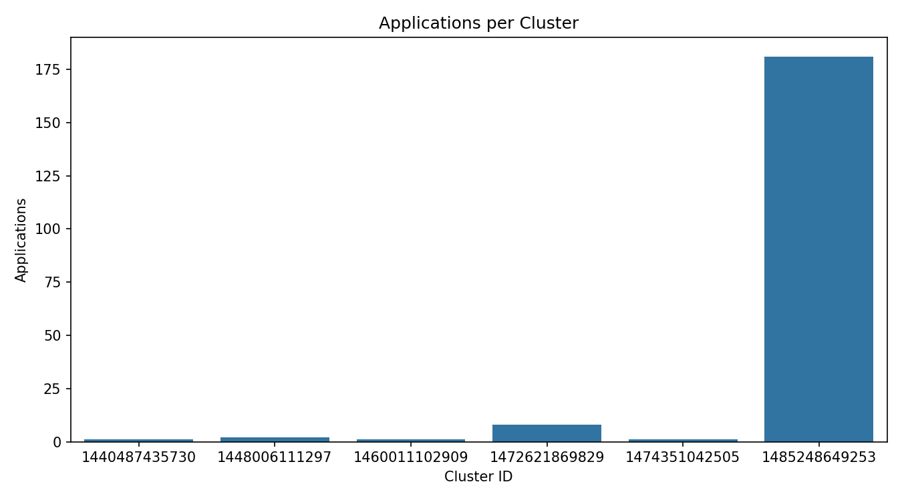
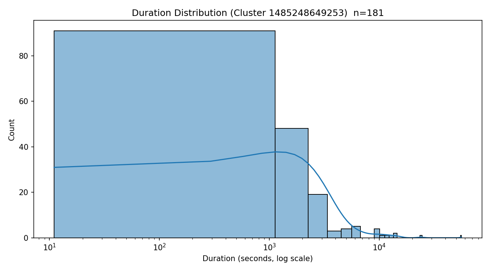

# ANALYSIS.md

## Problem 1: Log Level Distribution
**Goal:** Count log levels (INFO, WARN, ERROR, DEBUG) across all Spark logs.  
**Approach:**  
- Used `sparkContext.textFile()` to read all log files from S3 (`s3a://yz1395-assignment-spark-cluster-logs/...`).
- Extracted log levels using regex and filtered non-empty entries.
- Grouped and counted occurrences by log level, then saved counts, samples, and summary.
- Optimized Spark config with Adaptive Query Execution and caching.

**Findings:**  
- Total log lines processed: 33,236,604  
- Lines with log levels: 27,410,336  
- Distribution: INFO 99.92 %, WARN 0.04 %, ERROR 0.04 %  

**Performance:**  
- Runtime ≈ 20 minutes on cluster (3 workers × 4 cores).  
- Stages ≈ 22 due to multiple actions (`count`, `collect`, `groupBy`).

---

## Problem 2: Cluster Usage Analysis
**Goal:** Identify number and duration of applications per cluster.  
**Approach:**  
- Extracted `application_id` and `cluster_id` from log paths using `input_file_name()` + `regexp_extract()`.  
- Computed min / max timestamps per application to build timeline (`app_start`, `app_end`).  
- Aggregated per cluster to count applications and range of activity.  
- Generated `problem2_timeline.csv`, `problem2_cluster_summary.csv`, and `problem2_stats.txt`.  
- Plotted:
  - **Bar Chart:** Applications per cluster  
  - **Density Plot:** Duration distribution (log scale) for top cluster

**Findings:**  
- Total clusters = 6  
- Total applications = 194  
- Cluster 1485248649253 dominates (181 apps ≈ 93 %).  
- Durations mostly under 1 hour, few long-tail jobs > 10 000 s.

**Performance:**  
- Runtime ≈ 15 minutes on cluster;  
- Sample mode finished in < 1 minute (`--sample`).  
- Used caching and reduced shuffle partitions (200).

**Visualizations:**  
  

---

## Overall Observations
- Most logs are INFO level, indicating healthy job executions.  
- Cluster 1485248649253 handled the majority of workloads.  
- Adaptive Query Execution and caching reduced shuffle cost significantly.  
- Both analyses validated on sample data before full-cluster run.
